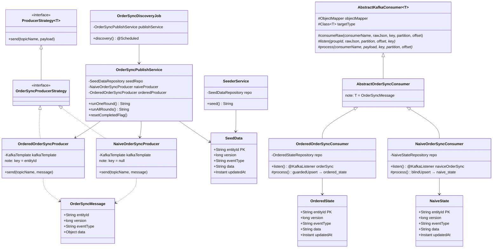
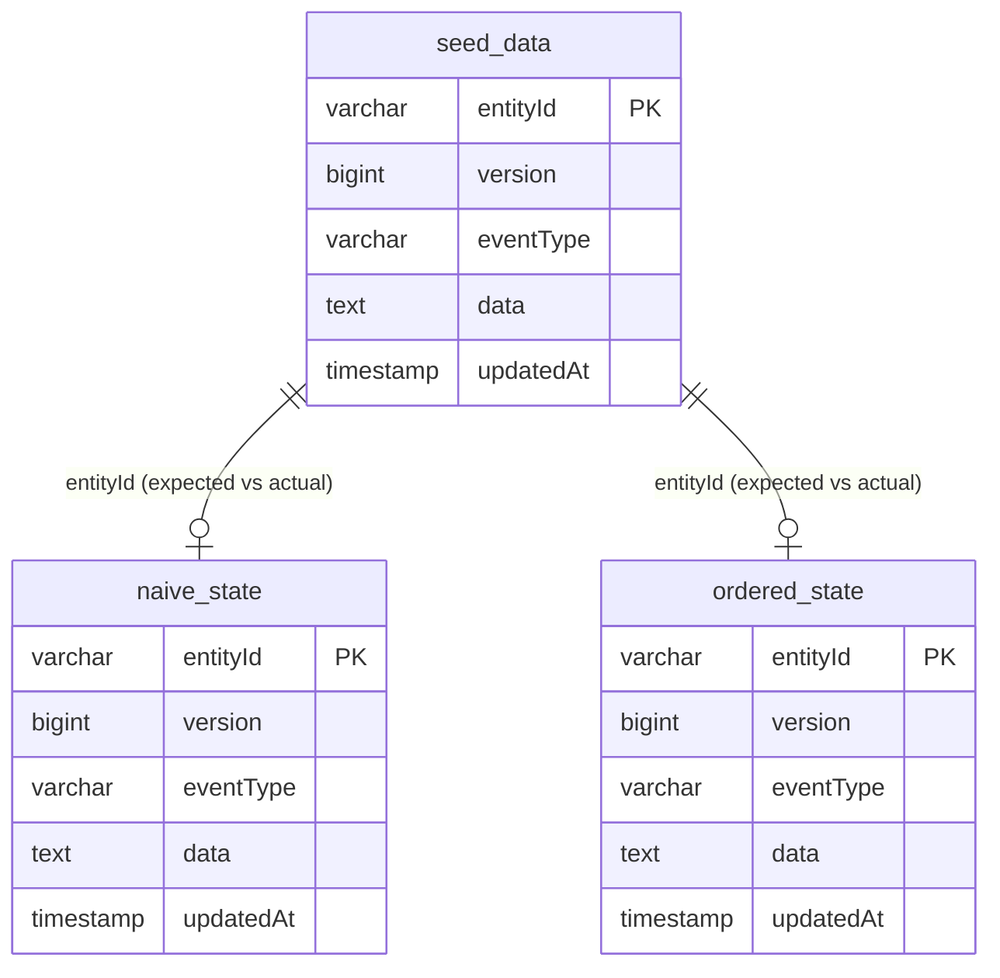

# Kafka Consumer Deduplication Demo

A hands-on demo that shows **what goes wrong when Kafka messages have no key** and how **keyed partitioning fixes it**.

---

## The Problem

In distributed systems, services often consume Kafka messages concurrently across multiple threads/partitions. When messages carry no key, Kafka distributes them round-robin — there is no guarantee that updates for the same entity arrive in order or land on the same thread. This causes **race conditions**:

> Thread A processes version 5, Thread B processes version 3 (delayed) — Thread B writes last → version 3 silently overwrites version 5 in the database.

This is called **out-of-order write corruption** and it is hard to detect because no error is thrown — the data is just quietly wrong.

---

## The Solution

When every message is **keyed by `entityId`**, Kafka's partitioner hashes the key to always route the same entity to the same partition. Since a partition is consumed by exactly one thread at a time, updates for the same entity are processed **strictly in order** — no race conditions possible.

---

## Architecture

### End-to-End Pipeline

```mermaid
flowchart TD
    subgraph REST["🌐 REST API (port 8085)"]
        DC["DemoController\n POST /demo/seed\n POST /demo/run\n POST /demo/run-all\n POST /demo/reset"]
        VC["VerificationController\n GET /verify"]
    end

    subgraph Services["⚙️ Services"]
        SS["SeederService\n generates 5,000 records\n at version=1"]
        PS["OrderSyncPublishService\n runs version increment rounds\n v1 → v2 → v3 → v4 → v5"]
    end

    subgraph Job["🕐 Scheduler"]
        JOB["OrderSyncDiscoveryJob\n @Scheduled fixed-delay\n scheduler-enabled=false by default"]
    end

    subgraph DB_A["🗄️ MySQL — Ground Truth"]
        SD[("seed_data\n State A\n entityId · version · data")]
    end

    DC -->|seed| SS
    DC -->|run / run-all| PS
    SS -->|saveAll 5k records| SD
    PS -->|reads + updates versions| SD
    JOB -->|delegates to| PS

    subgraph Producers["📤 Kafka Producers"]
        NP["NaiveOrderSyncProducer\n key = null\n round-robin partition"]
        OP["OrderedOrderSyncProducer\n key = entityId\n hash partition"]
    end

    PS -->|send| NP
    PS -->|send| OP

    subgraph KafkaBroker["☁️ Kafka Broker (localhost:9092)"]
        subgraph T1["Topic: naviceOrderSync (3 partitions)"]
            P0["Partition 0"]
            P1["Partition 1"]
            P2["Partition 2"]
        end
        subgraph T2["Topic: orderSync (3 partitions)"]
            P3["Partition 0\n entityId → always same partition"]
            P4["Partition 1\n entityId → always same partition"]
            P5["Partition 2\n entityId → always same partition"]
        end
    end

    NP -->|no key — any partition| P0
    NP -->|no key — any partition| P1
    NP -->|no key — any partition| P2
    OP -->|hash(entityId)| P3
    OP -->|hash(entityId)| P4
    OP -->|hash(entityId)| P5

    subgraph NaiveConsumer["🔴 NaiveOrderSyncConsumer (concurrency=3)"]
        direction TB
        NC["AbstractOrderSyncConsumer\n deserialize JSON → OrderSyncMessage"]
        NW["blindUpsert\n ON DUPLICATE KEY UPDATE\n no version check\n ⚠️ last writer wins"]
    end

    subgraph OrderedConsumer["🟢 OrderedOrderSyncConsumer (concurrency=3)"]
        direction TB
        OC["AbstractOrderSyncConsumer\n deserialize JSON → OrderSyncMessage"]
        OW["guardedUpsert\n ON DUPLICATE KEY UPDATE\n only if newVersion > stored\n ✅ always correct"]
    end

    P0 --> NC
    P1 --> NC
    P2 --> NC
    P3 --> OC
    P4 --> OC
    P5 --> OC

    NC --> NW
    OC --> OW

    subgraph DB_B["🗄️ MySQL — State B"]
        NS[("naive_state\n ❌ corrupted\n older versions overwrite newer")]
    end

    subgraph DB_C["🗄️ MySQL — State C"]
        OS[("ordered_state\n ✅ correct\n always final version")]
    end

    NW -->|writes| NS
    OW -->|writes| OS

    VC -->|compare A vs B\ncompare A vs C| SD
    VC -->|reads| NS
    VC -->|reads| OS
```

---

### Class Hierarchy



---

### Database Schema



---

## Data Flow

### 1. Ground Truth — State A (`seed_data` table)
- `POST /demo/seed` inserts **5,000 unique `OrderSyncMessage` records** at `version = 1`.
- This is the source of truth. After each publish round the job increments the version here too, so A always reflects the expected final state.

### 2. Producer Rounds
- `POST /demo/run` triggers one round: all 5,000 entities get their version incremented by 1 and published to **both** topics.
- 4 rounds total → final expected version = **5**.
- All 5,000 messages for version N are published before moving to version N+1.

### 3. Consumers Write to DB

| Consumer | Topic | Key | Concurrency | DB Write | Result |
|---|---|---|---|---|---|
| `NaiveOrderSyncConsumer` | `naviceOrderSync` | none (null) | 3 threads | `blindUpsert` — no version check | State B — **corrupted** |
| `OrderedOrderSyncConsumer` | `orderSync` | `entityId` | 3 threads | `guardedUpsert` — only if `newVersion > stored` | State C — **correct** |

### 4. Verification
`GET /verify` compares A vs B and A vs C:

```json
{
  "groundTruth":  { "totalEntities": 5000, "expectedVersion": 5 },
  "naiveState":   { "totalProcessed": 5000, "correct": 3821, "corrupted": 1179, "missing": 0, "corruptionRate": "23.58%" },
  "orderedState": { "totalProcessed": 5000, "correct": 5000, "corrupted": 0,    "missing": 0, "corruptionRate": "0.00%" }
}
```

---

## Project Structure

```
src/main/java/com/example/kafka_consumer_dedup/
├── config/
│   ├── KafkaConfig.java               # Producer + Consumer factories
│   ├── KafkaTopicConfig.java          # Topic creation (naviceOrderSync, orderSync)
│   └── OrderSyncKafkaProperties.java  # Typed config properties
├── controller/
│   ├── DemoController.java            # POST /demo/seed, /run, /run-all, /reset
│   └── VerificationController.java    # GET /verify
├── entity/
│   ├── SeedData.java                  # Table: seed_data  (State A)
│   ├── NaiveState.java                # Table: naive_state (State B)
│   └── OrderedState.java              # Table: ordered_state (State C)
├── job/
│   └── OrderSyncDiscoveryJob.java     # Scheduled job (manual or auto)
├── kafka/
│   ├── consumer/
│   │   ├── AbstractKafkaConsumer.java
│   │   ├── AbstractOrderSyncConsumer.java
│   │   ├── NaiveOrderSyncConsumer.java   # Writes State B (blind upsert)
│   │   └── OrderedOrderSyncConsumer.java # Writes State C (guarded upsert)
│   └── producer/
│       ├── NaiveOrderSyncProducer.java   # Sends with null key
│       └── OrderedOrderSyncProducer.java # Sends with entityId as key
├── model/
│   └── OrderSyncMessage.java
├── repository/
│   ├── SeedDataRepository.java
│   ├── NaiveStateRepository.java      # blindUpsert()
│   └── OrderedStateRepository.java    # guardedUpsert()
└── service/
    ├── SeederService.java             # Generates 5,000 seed records
    └── OrderSyncPublishService.java   # Core publish logic (used by job + controller)
```

---

## Prerequisites

- Java 21
- Maven
- Kafka running on `localhost:9092`
- MySQL running on `localhost:3306`

### MySQL Setup (one-time)

```sql
CREATE DATABASE demo_db;
```

Hibernate auto-creates the tables (`seed_data`, `naive_state`, `ordered_state`) on first startup.

---

## Running the App

```bash
./mvnw spring-boot:run
```

The scheduler is **disabled by default** (`ordersync.scheduler-enabled: false`).  
Use the REST endpoints below for manual control during the demo.

---

## Demo Walkthrough

```bash
# Step 1 — seed ground truth (5,000 entities at version=1)
curl -X POST http://localhost:8085/demo/seed

# Step 2a — run all 4 rounds at once (version 1→2→3→4→5)
curl -X POST http://localhost:8085/demo/run-all

# Step 2b — OR run one round at a time (good for live demo)
curl -X POST http://localhost:8085/demo/run   # version 2
curl -X POST http://localhost:8085/demo/run   # version 3
curl -X POST http://localhost:8085/demo/run   # version 4
curl -X POST http://localhost:8085/demo/run   # version 5

# Step 3 — see the corruption report
curl http://localhost:8085/verify

# Step 4 — reset consumer states to demo again (keeps seed entities)
curl -X POST http://localhost:8085/demo/reset
```

---

## Key Insight

The corruption in `naive_state` is not a bug in the consumer code — it is the **inevitable consequence of concurrent threads processing unordered messages**. The naive consumer does everything "correctly" — it just has no way to know it's receiving an older version after a newer one already landed.

Keyed partitioning removes the non-determinism entirely. The fix is not in the consumer logic — it is in how messages are routed to partitions.
